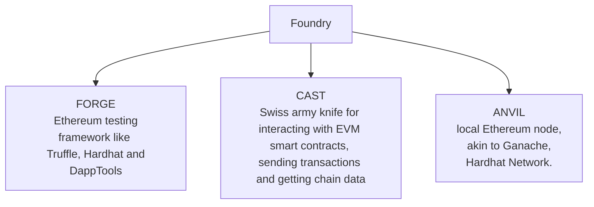

----
# TOC 

- [TOC](#toc)
- [Repo Description](#repo-description)
- [🍌 URL's Foundry Official Repo](#-urls-foundry-official-repo)
- [🍌 Repo Purpose](#-repo-purpose)
- [🍌 Issue Description](#-issue-description)
- [🍌 Awesome Foundry](#-awesome-foundry)
- [🍌 URLS](#-urls)
- [🍌 Disclaimer](#-disclaimer)

----
# 🍌 Repo Description 

Running list of resources for learning foundry 

# 🍌 URL's Foundry Official Repo 

1. [Official Repo](https://github.com/foundry-rs)
2. [Official Manual](https://github.com/foundry-rs/book) - [Readable](https://book.getfoundry.sh) - It is highly recommended to go through the manual before trying to learn it from external sources. In my experience, this will enable you to remember the official reference resources

# 🍌 Repo Purpose 

I am of the opinion that eventually SkidsDAO should have a great wiki and/or a [Rust mdBook](https://rust-lang.github.io/mdBook/) of learning resources in general. FOSS of course. Eventually, as I progress with acquiring evidence of actual ability I may look into this area under this banner or something else. This matter is under constant investigation.

# 🍌 Issue Description 

1. This issue is being made after observing the need to consolidate some learning resources for [Foundry](https://github.com/foundry-rs/foundry) - Which is an Ethereum Development Toolkit written in Rust. Which makes it very fast for compiling, testing & decoding. 
4. This issue will be list of strictly video learning resources which have been extracted from a variety of sources 
5. The following urls are not exhaustive in anyway, note there are new resources popping up all the time
6. It is highly recommended to follow [gakonst](https://twitter.com/gakonst) who is the founder of `Foundry` , this toolset is being updated constantly. 

# 🍌 Awesome Foundry 

[Awesome Foundry Resources](https://github.com/crisgarner/awesome-foundry)

# 🍌 URLS

1. [Youtube - Patric Collins- Intro to Foundry | The FASTEST Smart Contract Framework](https://youtu.be/fNMfMxGxeag)
2. [Youtube -  Chainlink - Introduction to Foundry](https://youtu.be/fG66LNaceWU)
3. [Youtube - Chainlink - Testing with Foundry](https://youtu.be/pgh74-XulXg)
7. [Youtube - Spearbit  - How to Foundry with Brock Elmore](https://youtu.be/Rp_V7bYiTCM)
8. [Youtube - Secureum - Secureum TrustX — Mainnet Room, 22 April - Introduction to Foundry by https://twitter.com/gakonst](https://youtu.be/q4mlkHGFO_w?t=6156)
9. [Youtube - James Bachini- Foundry Tutorial | Debug & Deploy Solidity Smart Contracts](https://youtu.be/VhaP9kYvlOA)
10. UPDATE - [Youtube - Nader Dabit - Smart Contract Development with Foundry](https://youtu.be/uelA2U9TbgM)

# 🍌 Disclaimer

SINCE NONE OF THE ABOVE MENTIONED RESOURCES ARE OFFICIALLY FROM THE MAKERS OF THIS TOOL, THEY ARE SUBJECT TO ERRORS, THE VIEWER IS ADVISED TO DYOR 